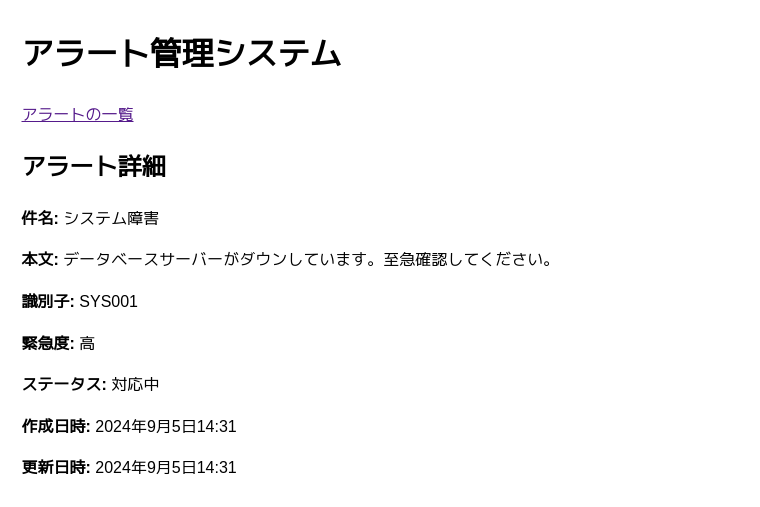

# alert-hub-mvp

Alert management system built using Django. It allows you to register alerts through an HTTP API and manage them via a Web UI.

This application is designed for demonstration purposes only. It is not suitable for use in a production environment.

## Features

- Alert registration via HTTP API
- Alert list display in Web UI
- Alert detail display in Web UI
- Alert status update via both Web UI and HTTP API
- No alert deletion functionality

## Setup

1. Create and activate a virtual environment:
   ```
   $ python3 -m venv venv
   $ source venv/bin/activate
   ```

2. Install required packages:
   ```
   $ pip install -r requirements.txt
   ```

3. Run database migrations:
   ```
   $ python3 manage.py makemigrations alerts
   $ python3 manage.py migrate
   ```

4. Start the development server:
   ```
   $ python3 manage.py runserver
   ```

## Web UI

Alert list: http://localhost:8000/alerts

Alert status can be updated directly from the alert list page.


Alert detail: http://localhost:8000/alert/\<id\>/



## HTTP API

Registering an alert ( POST request ):

```
$ curl -X POST http://localhost:8000/api/alerts/ \
     -H "Content-Type: application/json" \
     -d '{
         "subject": "System Failure",
         "body": "Database server is down.\nPlease check immediately.",
         "identifier": "SYS001",
         "urgency": "HIGH"
     }'
```

Retrieving the alert list ( GET request ):

```
$ curl http://localhost:8000/api/alerts/
```

Updating alert status ( PATCH request ):

```
$ curl -X PATCH http://localhost:8000/api/alerts/<id>/ \
     -H "Content-Type: application/json" \
     -d '{"status": "IN_PROGRESS"}'
```

## License

This project is licensed under the MIT License - see the [LICENSE](https://opensource.org/license/mit) for details.
